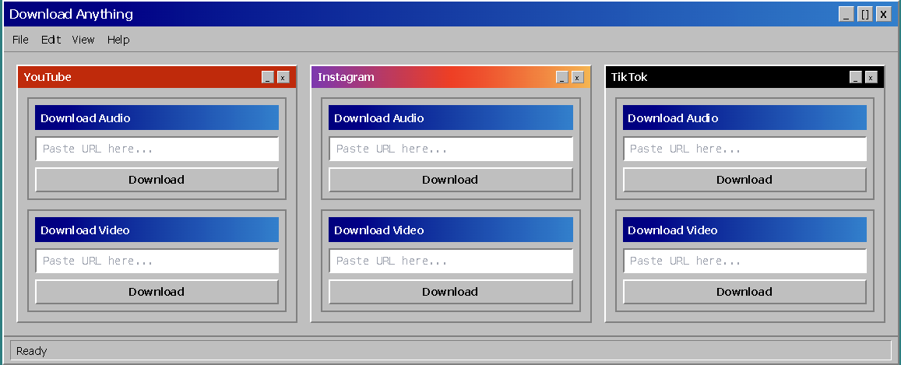

# download-anything

download audio and video from the big platforms

Classic React-tailwind with Go for the Backend.

Uses yt-dlp which is a command-line tool that helps download audio and video. It's a fork of youtube-dl with more features and active development. Handles extraction, format conversion, and metadata automatically.

Built this because i wanted the tool and was tired of looking through fishy websites, not knowing what it would download for me once i pressed the button.

Currently deployed using Railway.

End idea is to gather a bunch of tools that i use and selfhost it with a home-lab

download-anything/
├── backend/
│ ├── cmd/
│ │ └── server/
│ │ └── main.go
│ ├── internal/
│ │ ├── handlers/
│ │ │ ├── instagram.go
│ │ │ ├── tiktok.go
│ │ │ └── youtube.go
│ │ └── services/
│ │ ├── instagram.go
│ │ ├── tiktok.go
│ │ └── youtube.go
│ ├── go.mod
│ └── railway.toml
├── frontend/
│ ├── src/
│ │ ├── hooks/
│ │ │ └── useDownload.ts
│ │ ├── services/
│ │ │ └── api.ts
│ │ ├── App.tsx
│ │ ├── index.css
│ │ └── main.tsx
│ ├── index.html
│ ├── package.json
│ ├── tailwind.config.js
│ ├── tsconfig.json
│ ├── vite.config.ts
│ └── railway.toml
├── images/
│ └── download-anything-preview.png
└── README.md
